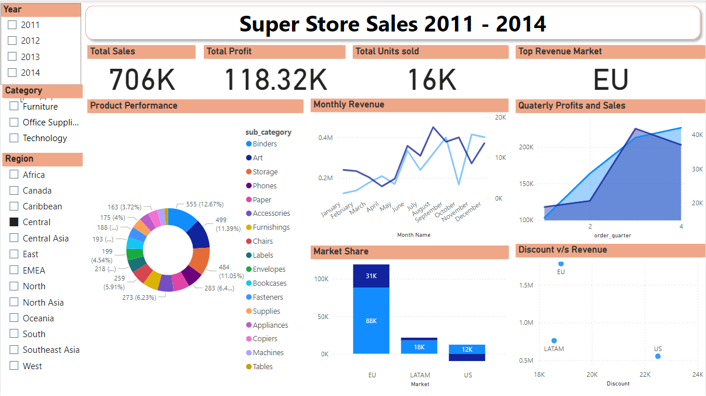

# **Retail Sales Analysis: Driving Business Growth Through Data Insights**  

**Dataset Link:** https://www.kaggle.com/datasets/laibaanwer/superstore-sales-dataset

## **Project Overview**  
This project analyzes four years (2011–2014) of Superstore sales data to derive actionable insights. The focus is on understanding revenue drivers, assessing profit margins, and evaluating the impact of discounts across regions and categories. The analysis enables informed decision-making for optimizing sales strategies, improving profitability, and identifying areas for operational efficiency.  

## **Key Business Questions Addressed**  

1. **What regions and markets generate the highest sales and profit?**  
   - Identify high-performing regions and their contribution to overall revenue and profitability.  

2. **How do discounts affect sales and profitability?**  
   - Evaluate whether discounts boost sales at the cost of profit margins.  

3. **What is the monthly and quarterly trend for revenue and profit?**  
   - Analyze sales seasonality and trends for inventory and marketing optimization.  

4. **What product categories or sub-categories are underperforming?**  
   - Pinpoint areas of improvement for product offerings or pricing.  

5. **How does the market share compare across regions?**  
   - Slice metrics by region to identify opportunities for expansion or focus.  

---

## **Tools and Technologies**  
- **Languages:** Python  
- **Visualization Tools:** Power BI, Matplotlib, Seaborn  
- **Libraries and Frameworks:** Pandas, NumPy    

---

## **Methodology and Approach**  
1. **Data Preparation and Cleaning:**  
   - Handled missing values, standardized formats, and prepared the data for analysis using Python (Pandas).  

2. **Exploratory Data Analysis:**  
   - Used descriptive statistics and visualizations to uncover revenue and profit patterns.  

3. **Segmentation and Metrics Calculation:**  
   - Analyzed key metrics (Total Sales, Total Profit, Units Sold) sliced by **Category**, **Region**, and **Time Periods** (Months, Quarters).  

4. **Discount Impact Analysis:**  
   - Assessed the relationship between discounts and profitability, identifying the optimal balance between revenue and margin.  

5. **Visualization and Reporting:**  
   - Developed an interactive Power BI dashboard to explore insights by segments.  

---

## **Key Findings**  
1. **Top Performing Regions:**  
   - The EU market consistently outperforms in total sales, with significant contributions to overall profit.  

2. **Seasonality in Sales:**  
   - Peak sales occur during the holiday season (November and December), indicating the importance of seasonal campaigns.  

3. **Impact of Discounts:**  
   - While discounts increase sales, they lead to a decline in profit margins across categories, requiring a more strategic discounting approach.  

4. **Underperforming Sub-Categories:**  
   - Certain sub-categories, such as **Binders** and **Chairs**, show weak profit performance despite high sales volume.  

---

## **Recommendations**  
1. **Focus Marketing Efforts on High-Performing Regions:**  
   - Allocate resources to regions like **EU** and **North America** with proven growth potential.  

2. **Refine Discount Strategy:**  
   - Implement targeted discounts on high-margin products while phasing out discounts on low-performing categories.  

3. **Leverage Seasonality Trends:**  
   - Align inventory and marketing campaigns with peak periods (e.g., holiday seasons) to maximize revenue.  

4. **Reassess Low-Performing Sub-Categories:**  
   - Evaluate and adjust pricing, marketing, or product offerings for underperforming sub-categories.  

---

## **Dashboard** 

The interactive dashboard visualizes total sales, profits, units sold, regional performance, monthly revenue, and discount impacts.  

## **Conclusion**  
This project demonstrates the value of data-driven strategies in retail. By focusing on high-value regions, optimizing discount strategies, and aligning with seasonal trends, businesses can drive sustainable growth and profitability.  

